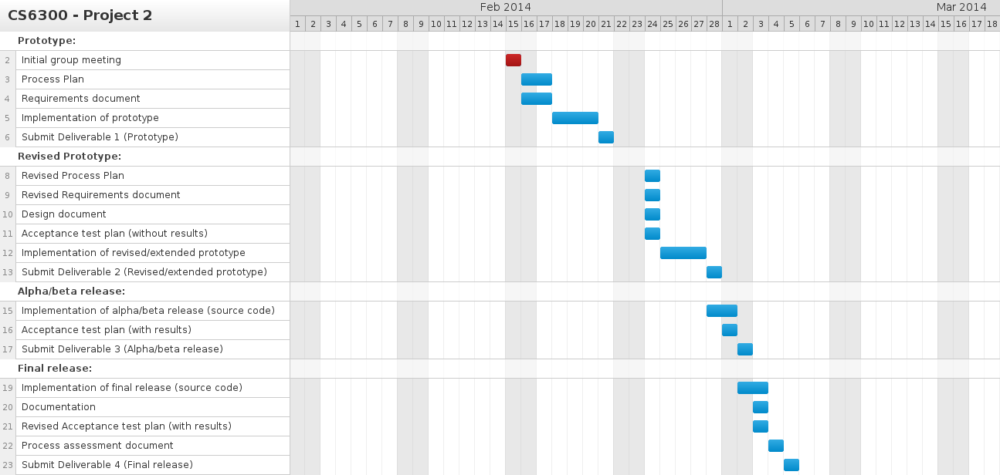

# Process Plan Document – Team 29

## **1 Introduction**
TODO is an Android application that manages TODO lists. This application supports multiple users, multiple lists per user, and priority and due date for each item in a list. Users of the application are able to add, delete, and edits tasks on their lists. Tasks on the list will be automatically saved after modification. In addition, TODO allows users to check-off each task after completion. 

### **1.1 Definitions and Acronyms**

- **TODO** - Android application that manages TODO lists

- **EP** - Evolutionary Prototyping

- **Prototype** - An initial sample or model of a product

- **Android** - An operating system that is based on the Linux kernel. It is designed for mobile devices that are primarily touchscreen, such as tablets and smartphones.

- **Evolutionary Prototyping** - A software process model that deals with designing and implementing an initial prototype and refining the prototype until it is acceptable for release.

## **2 Process Description**

### **2.1 Project Lifecycle**

Evolutionary prototyping will be used to manage the TODO project. The TODO project will progress through the following phases:

Initial Concept -> Design of initial prototype -> Implementation of initial prototype -> Testing of initial prototype -> Refine prototype -> Complete and release prototype

After the initial concept of the application is discussed with the customer, a UI prototype will be created and delivered to the customer for early feedback. Once feedback is received, the project team will design and implement the prototype of the application based on customer’s requirements and early feedback. Updated versions of the prototype is delivered to the customer for feedback until the prototype is finally acceptable for release.

- **Initial Concept** - The initial concept of the Android application is discussed with the customer and requirements are gathered. The UI prototype is created based on customer’s requests and delivered to customer for early feedback.

- **Design of initial prototype** - Design of the application that includes the architectural design, low level design, and user interface design.

- **Implementation of initial prototype** - Developer implements the application based on given requirements. Testing is performed on the application against test cases before the application is delivered to the customer for feedback.

- **Refine prototype** - Feedback from customer is taken into consideration and prototype is revised/extended. The prototype is continuously refined based on customer’s feedback until acceptable for release.

- **Complete and release prototype** - Customer is happy with the latest version of the prototype and the prototype is released to the public.

### 2.2 Process Activities
Process description as a set of activities; for each activity, provide the following:
* Activity name (verb or verb phrase)
* Activity description (paragraph)
* Entrance criteria (activity inputs and how you know that they have sufficient quality)
* Exit criteria (deliverable document description and how you know it has been completed satisfactorily)

1) 

 - **Phase** - Initial Concept
 -  **Activity Name** - Speak to customer
 -  **Activity Description** - Team speaks to customer to get the general idea of what customer wants
 -  **Entrance criteria** - Schedule meeting with customer
 -  **Exit criteria** - Good understanding of customer’s requests

2)

- **Phase** - Initial Concept
- **Activity Name** - Gather requirements
- **Activity Description** - Requirements specified by the customer are documented
- **Entrance Criteria**- Project’s scope is clearly defined
- **Exit criteria**- Requirements Document

3)

- **Phase** - Initial Concept
- **Activity Name** - Create UI prototype
- **Activity Description** - An initial UI prototype is created based on customer’s requirements
- **Entrance Criteria**- Customer requirements are clearly defined
- **Exit Criteria**- Receive feedback from customer 

4)

- **Phase** - Designing of initial prototype
- **Activity Name**  - Software and architectural design of application
- **Activity Description**- Create software design using UML and architectural design 
- **Entrance Criteria** - Customer signs-off on Requirements document and provides feedback on UI prototype
- **Exit Criteria** - Design Document

5)

- **Phase** - Implementing initial prototype
- **Activity Name** - Code application
- **Activity Description**- Implement application based on requirements 
- **Entrance Criteria**- Draft of design document is completed
- **Exit Criteria**- Unit testing completed

6)

- **Phase** - Refining prototype
- **Activity Name** - Deliver latest version of prototype to customer
- **Activity Description**- Team delivers prototype to customer. Based on customer’s feedback, the team will either edit/extend the prototype or release the latest version to the public.
- **Entrance Criteria**- Implementation of initial/updated versions of prototype complete
- **Exit Criteria**- Customer provides feedback on delivered prototype

7)

- **Phase** - Refining prototype
- **Activity Name** - Edit/extend prototype
- **Activity Description**- Feedback is taken into consideration and the prototype is edited/extended and tested and delivered back to the customer for review. 
- **Entrance Criteria**- Feedback is received from customer
- **Exit Criteria**- Prototype is updated and delivered back to customer for feedback

8)

- **Phase** - Complete and Release prototype
- **Activity Name** - Approved by customer
- **Activity Description**- The latest version of the prototype is approved by the customer and is ready for release to the public
- **Entrance Criteria**- Latest version of prototype is delivered to customer for feedback
- **Exit Criteria**- Customer approves for release

## **3 Roles**

The following section identifies the project's team members, outlines the different roles, and defines role assignments for each member of the team.

### **3.1 Team member names**

 - Kimberly Sirichoke
 - Jeffrey Valdez
 - Tyrie Vella
 - Probir Ghosh

### 3.2 Roles Table
Provide a table like the following with a short description of each role.

<table>
<tbody>
	<tr>
		<td><b>Role</b></td>
		<td><b>Responsibilities</b></td>
	</tr>

	<tr>
		<td><b>Project Manager</b></td>
		<td>Manages all the deliverables and the timeline of the project. Responsible for communicating with all team members to ensure that individual responsibilities are completed by a given deadline. Resolves issues between members of the team if situation does arise.</td>
	</tr>
	
	<tr>
	    <td><b>Architect</b></td>
	    <td>Responsible for the architectural and software design of the application</td>
	</tr>
	
	<tr>
	    <td><b>Developer</b></td>
	    <td>Codes the application and performs unit testing</td>
    </tr>
    
    <tr>
        <td><b>Tester</b></td>
        <td>Creates and executes test cases for the application. Ensures application meets all the requirements described in the Requirements document</td>
	
</tbody>
</table>

### **3.3 Role assignment table**

<table>
<tbody>
	<tr>
		<td><b>Role</b></td>
		<td><b>Team member(s)</b></td>
	</tr>

	<tr>
		<td><b>Project Manager</b></td>
		<td>Kimberly Sirichoke</td>
	</tr>
	
	<tr>
	    <td><b>Architect</b></td>
	    <td>Probir Ghosh</td>
	</tr>
	
	<tr>
	    <td><b>Developer</b></td>
	    <td>Jeffrey Valdez</td>
	</tr>
	
	<tr>
	    <td><b>Tester</b></td>
	    <td>Tyrie Vella</td>
	
</tbody>
</table>

## **4 Estimates**

### **4.1 Effort Estimate**
Provide estimates for the following metrics:

<table>
<tbody>
	<tr>
		<td><b>Task</b></td>
		<td><b>Note</b></td>
		<td><b>Total Hour(s)</td>
	</tr>

	<tr>
		<td><b>Requirements Gathering</b></td> 
		<td>Discussing requirements of TODOList</td>
		<td>1</td>
	</tr>

	<tr>
		<td><b>Deliverable 1</b></td> 
		<td>Prototype - 12 hrs, Process Plan-8 hrs, Requirements doc -8 hrs</td>
		<td>28</td>
	</tr>
	<tr>
		<td><b>Deliverable 2</b></td> 
		<td>Revised prototype - 12 hr., Revised Process Plan - 2 hr., Revised Requirements doc - 2 hr., Acceptance Test Plan (no results) - 3 hrs, Design Document - 16 hrs.</td>
		<td>35</td>
	</tr>
	<tr>
		<td><b>Deliverable 3</b></td> 
		<td>Alpha/beta release (source code) - 16 hrs. , Acceptance Test Plan (with results) - 8 hrs.</td>
		<td>24</td>
	</tr>

	<tr>
		<td><b>Deliverable 4</b></td> 
		<td>Final release (source code) - 16 hrs, Revised Acceptance Test Plan (with results) - 4 hrs., User Documentation - 6 hrs., Process Assessment doc. - 6 hrs.</td>
		<td>32</td>
	</tr>
		<tr>
		<td><b>TOTAL HOURS</b></td> 
		<td></td>
		<td>120</td>
		
	</tr>
	<tr>
	    <td></td>
	    <td></td>
	    <td></td>
	</tr>
	
	
</tbody>
</table>

### 4.2 Schedule

